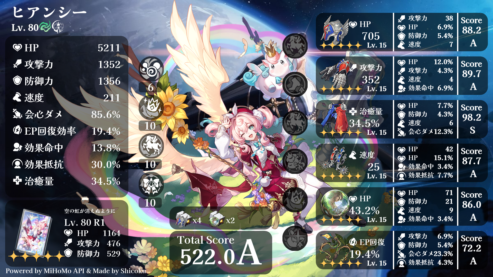

# StarRail-Build-Card

本プロジェクトは、[崩壊スターレイル](https://hsr.hoyoverse.com/ja-jp/home)のビルドカードを作るためのプログラムです。



# 環境

- Node.js v22.14.0

# 準備
[Releases](https://github.com/Shicoku/StarRail-Build-Card/releases)より、最新バージョンをダウンロード、展開してください。
<br />なお、このプロジェクトをクローンしても構いません。


以下のリポジトリをクローンしてください。

1. [StarRailScore](https://github.com/Mar-7th/StarRailScore) にて、`score.json`
2. [StarRailRes](https://github.com/Mar-7th/StarRailRes)にて、`iconフォルダ`・ `imageフォルダ`

続いて以下のコマンド実行し、必要なパッケージをインストールします。

```
$ npm install
```

# 使い方(簡易版)

`index.js`にて、`main`関数内に各自の`uid`を入力し、実行してください。
<br />詳しい使い方については[使い方](./doc/use.md)を参照してください

# ご使用にあたって

ご自由に使用して構いません。また、コードの改造や自プロジェクトへの組み込みなども自由にしてください。
<br />なお、[崩壊スターレイル](https://hsr.hoyoverse.com/ja-jp/home)の規約に反するものはすべて禁止です。

# クレジット

## 素敵なゲーム様

[崩壊スターレイル](https://hsr.hoyoverse.com/ja-jp/home)

## モジュール

- fs
- [node canvas](https://github.com/Automattic/node-canvas)

## リポジトリ

- [StarRailScore](https://github.com/Mar-7th/StarRailScore)
- [StarRailRes](https://github.com/Mar-7th/StarRailRes)

## バージョニング
[セマンティック バージョニング 2.0.0](https://semver.org/lang/ja/)

# ライセンス

[MIT License](LICENSE)

Copyright (c) 2025 Shicoku / Syu

# お問い合わせ

ご質問等ございましたら、気軽にお声がけください。
<br />[XのDM](https://x.com/H2DH8K)、またはメールアドレス shicoku07@gmail.com 等でお願いします。

# 更新

[Change Log](./doc/changelog.md)